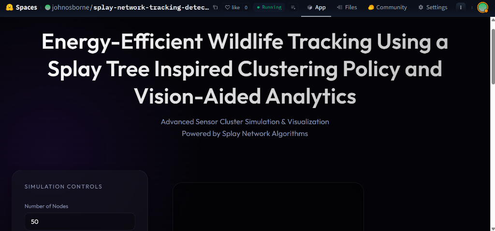

# Energy-Efficient Wildlife Tracking Using a Splay Tree Inspired Clustering Policy and Vision-Aided Analytics

This project implements a cohesive system that combines **Splay Network Algorithms** for efficient sensor communication with **Real-Time AI Computer Vision** for wildlife tracking. It is designed to simulate a high-tech conservation network where "Edge Nodes" (sensors) capture low-resolution data, and a central "Server" restores and analyzes it.

## Key Features

### 1. Splay Network Simulation (The Backbone)
- **Dynamic Clustering**: Visualizes how sensor nodes self-organize into clusters to save energy.
- **Splay-Tree Optimization**: Uses splay algorithms to determine optimal routing paths to the gateway.
- **Energy Modeling**: Simulates battery drain (green -> yellow -> red -> dead) and tracks network lifespan.
- **Live Dashboard**: Monitors network health, tracking active vs. dead nodes and downtime.

### 2. AI Wildlife Analytics (The Intelligence)
- **Simulated Edge-to-Server Pipeline**:
    - **Edge Step**: Takes raw video frames and downscales them to 128px "thumbnails" (mimicking low-bandwidth transmission).
    - **Restoration Step**: Uses **SwinIR** (simulated) on the server to upconvert thumbnails back to 640px.
- **Object Detection**: Utilizing **YOLOv8** (Nano) to identify animals in the restored feed.
- **Tracking**: Implementing **DeepSORT** to assign unique IDs to animals and track their movement across frames.

## How to Run

### Option 1: Live Demo (Hugging Face)
This project is deployed on Hugging Face Spaces for high-performance AI inference.
[**View Live Demo**](https://huggingface.co/spaces/johnosborne/splay-network-tracking-detection)




### Option 2: Run Locally
1.  **Clone the Repository**:
    ```bash
    git clone https://github.com/john-osborne-j/-splay-network.git
    cd splay-network
    ```
2.  **Install Dependencies**:
    ```bash
    python -m venv venv
    venv\Scripts\activate  # Windows
    pip install -r requirements.txt
    ```
3.  **Run the App**:
    ```bash
    python app.py
    ```
4.  **Access**: Open `http://localhost:5000` in your browser.

## 🛠 Tech Stack
- **Backend**: Python, Flask, Gunicorn
- **Frontend**: HTML5, Vanilla CSS (Glassmorphism), JavaScript (Canvas API)
- **AI/ML**: PyTorch, Ultralytics YOLOv8, DeepSORT, OpenCV
- **Deployment**: Docker, Hugging Face Spaces

## Project Structure
- `app.py`: Main Flask server endpoints.
- `simulation.py`: Logic for Splay Network nodes, energy, and routing.
- `detection.py`: AI pipeline (SwinIR Restoration + YOLO Detection + DeepSORT).
- `static/`: CSS styling and JavaScript simulation loop.
- `templates/`: HTML frontend interface.

---
**Created by John Osborne J **
*Powered by Splay Algorithms & Modern AI*
